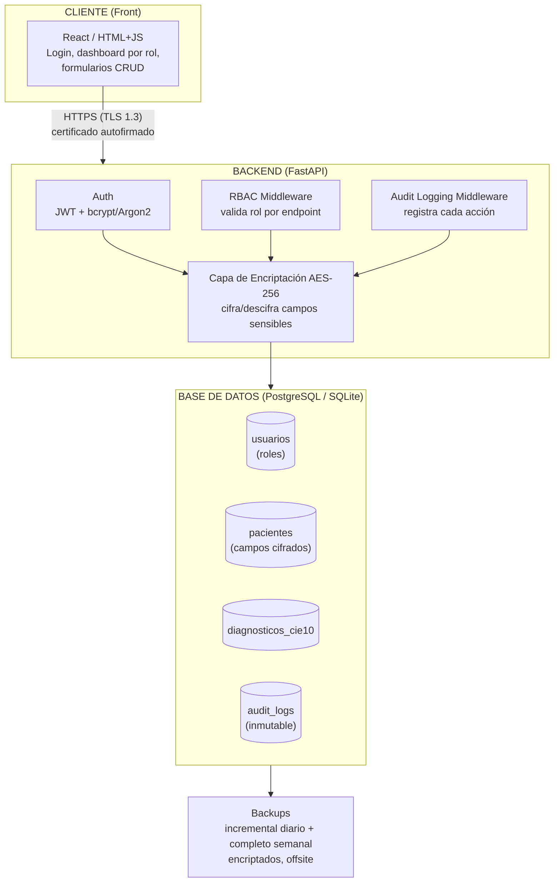
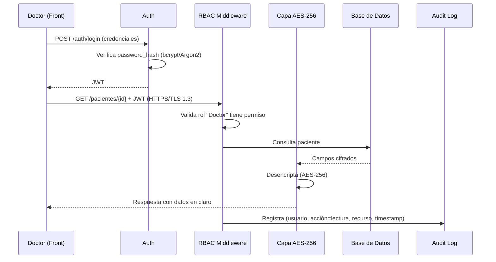

# CriptoMed
> Proyecto de Ética y Seguridad de los Datos – DS3031

Plataforma web que permite a clínicas pequeñas y consultorios independientes centralizar los historiales médicos de sus pacientes de forma segura, con acceso controlado por roles, datos encriptados en reposo y tránsito, y trazabilidad completa de cada acceso o modificación.

---

## Tabla de contenidos
- [Problema y motivación](#problema-y-motivación)
- [Caso de negocio](#caso-de-negocio)
- [KPIs / OKRs](#kpis--okrs)
- [Datasets](#datasets)
- [Arquitectura](#arquitectura)
- [Modelo de datos](#modelo-de-datos)
- [Roles y permisos](#roles-y-permisos)
- [Seguridad](#seguridad)
- [Stack técnico](#stack-técnico)
- [Estructura del repositorio](#estructura-del-repositorio)
- [Endpoints principales](#endpoints-principales)
- [Cumplimiento normativo](#cumplimiento-normativo)
- [Documentación](#documentación)
- [Recomendaciones futuras](#recomendaciones-futuras)

---

## Problema y motivación

Las clínicas pequeñas y consultorios independientes en Perú suelen manejar historiales médicos en papel o en hojas de Excel sin protección, lo que genera:

- Riesgo de pérdida de información crítica (sin backups)
- Acceso no controlado (cualquier personal puede ver cualquier historial)
- Incumplimiento de la **Ley N° 29733** (Ley de Protección de Datos Personales del Perú)
- Dificultad para auditar quién accedió a qué información y cuándo

## Caso de negocio

CriptoMed centraliza los historiales médicos en un sistema con **control de acceso basado en roles (RBAC)**, **encriptación de campos sensibles**, y **logs de auditoría inmutables**, permitiendo a la clínica operar de forma más rápida, segura y conforme a la normativa.

## KPIs / OKRs

| Objetivo | Key Result |
|---|---|
| Reducir el riesgo de exposición de datos sensibles | 100% de campos sensibles encriptados en reposo |
| | 0 incidentes de acceso no autorizado en 6 meses |
| Mejorar la eficiencia operativa | Reducir tiempo de acceso a un historial de ~10 min a < 30 seg |
| | 100% de accesos registrados en logs de auditoría |
| Cumplimiento normativo | 100% de requisitos de la Ley N° 29733 cubiertos |
| | Detectar accesos anómalos en < 24 horas (vs. promedio industria de 279 días — IBM Cost of a Data Breach Report 2025) |

## Datasets

| Dataset | Fuente | Uso |
|---|---|---|
| `healthcare_dataset.csv` | [Kaggle – prasad22/healthcare-dataset](https://www.kaggle.com/datasets/prasad22/healthcare-dataset) | Dataset principal: pacientes, admisiones, diagnósticos, facturación |
| `cie10.csv` | [Hugging Face – rubend18/CIE10](https://huggingface.co/datasets/rubend18/CIE10) | Normalización de diagnósticos a código CIE-10 estándar |
| `healthcare_dataset_mapped.csv` | Generado localmente | Dataset principal + FK `Codigo_CIE10` |

---

## Arquitectura



**Flujo de una petición típica (ej. Doctor consulta historial de un paciente):**




**Flujo de una petición típica (ej. Doctor consulta historial de un paciente):**
1. Front envía credenciales → Backend valida con bcrypt/Argon2 → emite JWT.
2. Front envía JWT en cada request sobre HTTPS.
3. Middleware RBAC valida que el rol "Doctor" tenga permiso sobre el endpoint solicitado.
4. Backend consulta la DB, desencripta los campos sensibles (AES-256) solo para la respuesta.
5. Middleware de auditoría registra: usuario, acción, timestamp, recurso, en `audit_logs` (append-only).
6. Front recibe y muestra la data.

## Modelo de datos

**`usuarios`**
| Campo | Tipo | Notas |
|---|---|---|
| id | UUID / PK | |
| nombre | string | |
| email | string, único | |
| password_hash | string | bcrypt/Argon2 |
| rol | enum | `admin`, `doctor`, `administrativo`, `auditor` |
| activo | boolean | para revocación de accesos |
| creado_en | timestamp | |

**`pacientes`**
| Campo | Tipo | Notas |
|---|---|---|
| id | UUID / PK | |
| nombre | string (cifrado AES-256) | |
| edad | int | |
| genero | string | |
| tipo_sangre | string | |
| diagnostico | string (cifrado AES-256) | |
| codigo_cie10 | FK → `diagnosticos_cie10` | |
| fecha_admision | date | |
| doctor_id | FK → `usuarios` | |
| hospital | string | |
| proveedor_seguro | string | |
| monto_facturado | decimal (cifrado AES-256) | |
| numero_habitacion | string | |
| tipo_admision | string | |
| fecha_alta | date | |
| medicacion | string (cifrado AES-256) | |
| resultado_test | string (cifrado AES-256) | |

**`diagnosticos_cie10`**
| Campo | Tipo |
|---|---|
| codigo | string / PK |
| descripcion | string |

**`audit_logs`** *(inmutable, solo-lectura salvo el sistema)*
| Campo | Tipo | Notas |
|---|---|---|
| id | UUID / PK | |
| usuario_id | FK → `usuarios` | |
| accion | enum | `login`, `lectura`, `edicion`, `borrado` |
| recurso | string | ej. `paciente:UUID` |
| timestamp | datetime | |
| ip_origen | string | |

## Roles y permisos

| Rol | Login | Ver pacientes | Ver diagnóstico/facturación | Editar pacientes | Gestionar usuarios | Ver audit logs |
|---|---|---|---|---|---|---|
| **Administrador** | ✅ | ✅ | ✅ | ✅ | ✅ | ✅ |
| **Doctor** | ✅ | ✅ (asignados) | ✅ (asignados) | ✅ (asignados) | ❌ | ❌ |
| **Administrativo** | ✅ | ✅ (datos básicos) | ❌ | ✅ (admisión/facturación) | ❌ | ❌ |
| **Auditor** | ✅ | ❌ | ❌ | ❌ | ❌ | ✅ (solo lectura) |

## Seguridad

| Medida | Implementación |
|---|---|
| Encriptación en reposo | AES-256 sobre campos sensibles (diagnóstico, facturación, medicación, resultados de test) |
| Encriptación en tránsito | HTTPS con TLS 1.3, certificado digital autofirmado (OpenSSL) |
| Hashing de contraseñas | bcrypt o Argon2 |
| Autenticación | JWT con expiración + expiración de sesión por inactividad |
| Autorización | RBAC (4 roles), principio de mínimo privilegio |
| Auditoría | Logs inmutables de login/lectura/edición/borrado |
| Política de contraseñas | Mínimo 10 caracteres, mayúsculas/números/símbolos, rotación cada 90 días |
| Backups | Incremental diario + completo semanal, encriptados, offsite |
| RTO / RPO | RTO < 4h, RPO < 24h |
| Análisis de vulnerabilidades (propuesto) | OWASP ZAP (dinámico), Bandit (estático, Python) |
| Plan de incidentes | Detección → Contención → Notificación → Remediación → Post-mortem |

## Stack técnico

| Capa | Tecnología |
|---|---|
| Backend | Python + FastAPI |
| Base de datos | PostgreSQL (o SQLite para desarrollo local) |
| ORM | SQLAlchemy |
| Auth | JWT (`python-jose`) + `passlib[bcrypt]` |
| Encriptación | `cryptography` (Fernet / AES-256) |
| Front | React (o HTML/JS simple) |
| Certificados | OpenSSL (autofirmado) |
| Control de versiones | Git / GitHub |
| Informe | GitHub Pages o Notion |

## Desarrollo local (paso 1)

### Usar Docker para PostgreSQL

```bash
# iniciar postgresql en docker
docker compose up -d

# crear tablas en la base de datos
python3 backend/scripts/setup_db_docker.py

# iniciar backend
source .venv/bin/activate
cd backend && uvicorn app.main:app --reload --host 127.0.0.1 --port 8000
```

Comprobar: `curl http://127.0.0.1:8000/health` → `{"status":"ok",...}`  
Docs interactivas: http://127.0.0.1:8000/docs

## Estructura del repositorio

```
criptomed/
├── backend/
│   ├── app/
│   │   ├── main.py
│   │   ├── models.py          # usuarios, pacientes, diagnosticos_cie10, audit_logs
│   │   ├── schemas.py
│   │   ├── auth.py            # login, JWT, hashing
│   │   ├── rbac.py            # middleware de roles
│   │   ├── crypto.py          # cifrado/descifrado AES-256
│   │   ├── audit.py           # middleware de logging
│   │   └── routers/
│   │       ├── pacientes.py
│   │       ├── usuarios.py
│   │       └── audit_logs.py
│   ├── certs/                 # cert.pem, key.pem (autofirmados, NO subir a git)
│   ├── scripts/
│   │   ├── setup_db_docker.py # script de setup de base de datos
│   │   ├── seed_db.py         # script de carga de datos
│   │   ├── backup_db.sh       # script de backup de postgresql
│   │   ├── create_user.py     # script de creación de usuarios
│   │   ├── verificar_cifrado.py # script de verificación de cifrado
│   │   └── verificar_logs.py  # script de verificación de logs
│   ├── data/
│   │   ├── healthcare_dataset.csv
│   │   ├── cie10.csv
│   │   └── healthcare_dataset_mapped.csv
│   └── requirements.txt
├── frontend/
│   ├── src/
│   │   ├── pages/ (Login, Dashboard, PacienteDetalle, AuditLog)
│   │   ├── components/ (Layout)
│   │   ├── context/ (AuthContext)
│   │   └── App.jsx
│   └── package.json
├── docs/
│   ├── RECOVERY_PLAN.md               # plan de recuperación ante desastres
│   ├── HTTPS_CONFIGURATION.md         # configuración https (http vs https)
│   ├── PASSWORD_POLICY.md             # políticas de contraseñas
│   ├── USER_MANAGEMENT.md             # procedimientos de gestión de usuarios
│   ├── SECURITY_AWARENESS.md          # concientización y formación del equipo
│   ├── INCIDENT_RESPONSE.md           # plan de respuesta ante incidentes
│   ├── NOTIFICATION_PROCEDURES.md     # procedimientos de notificación
│   ├── MITIGATION_PROCEDURES.md       # procedimientos de mitigación
│   ├── FUTURE_RECOMMENDATIONS.md      # recomendaciones futuras de seguridad
│   └── FINAL_REPORT.md                # informe final completo
├── data/
│   ├── cie10.csv
│   └── healthcare_dataset_mapped.csv
├── docker-compose.yml
├── .env
├── .env.example
├── .gitignore
├── README.md
└── SETUP_GUIDE.md
```

## Endpoints principales

| Método | Ruta | Rol requerido | Descripción |
|---|---|---|---|
| POST | `/auth/login` | público | Login, retorna JWT |
| GET | `/pacientes` | doctor, admin, administrativo | Lista pacientes (campos según rol) |
| GET | `/pacientes/{id}` | doctor (asignado), admin | Detalle completo |
| POST | `/pacientes` | admin, administrativo | Crear paciente/admisión |
| PUT | `/pacientes/{id}` | doctor (asignado), admin | Editar historial |
| DELETE | `/pacientes/{id}` | admin | Borrado (soft-delete) |
| GET | `/usuarios` | admin | Gestión de usuarios |
| POST | `/usuarios` | admin | Crear usuario |
| PATCH | `/usuarios/{id}/revocar` | admin | Revocar acceso |
| GET | `/audit-logs` | auditor, admin | Consultar logs (solo lectura) |

## Cumplimiento normativo

- **Ley N° 29733** – Ley de Protección de Datos Personales del Perú (aplicación directa: datos de salud = datos sensibles).
- Referencia complementaria: principios de **HIPAA** (EE.UU.), dado que la estructura del dataset base sigue ese estándar.

## Documentación

Toda la documentación detallada del proyecto se encuentra en la carpeta `/docs/`:

**Documentación de Seguridad:**
- `docs/RECOVERY_PLAN.md` - Plan de recuperación ante desastres
- `docs/HTTPS_CONFIGURATION.md` - Configuración HTTPS (HTTP vs HTTPS)
- `docs/PASSWORD_POLICY.md` - Políticas de contraseñas
- `docs/USER_MANAGEMENT.md` - Procedimientos de gestión de usuarios
- `docs/SECURITY_AWARENESS.md` - Concientización y formación del equipo
- `docs/INCIDENT_RESPONSE.md` - Plan de respuesta ante incidentes
- `docs/NOTIFICATION_PROCEDURES.md` - Procedimientos de notificación
- `docs/MITIGATION_PROCEDURES.md` - Procedimientos de mitigación
- `docs/FUTURE_RECOMMENDATIONS.md` - Recomendaciones futuras de seguridad

**Documentación de Proyecto:**
- `docs/FINAL_REPORT.md` - Informe final completo (diseño, motivación, trasfondo teórico, requerimientos, implementación, lecciones aprendidas, retrospectiva)

**Documentación de Setup:**
- `SETUP_GUIDE.md` - Guía de setup del proyecto
- `README.md` - Este archivo

**Scripts:**
- `backend/scripts/backup_db.sh` - Script de backup de PostgreSQL

## Recomendaciones futuras

- Autenticación multifactor (MFA) para todos los roles
- Migrar de certificado autofirmado a CA reconocida en producción
- Cifrado a nivel de columna con rotación periódica de llaves (key rotation)
- Web Application Firewall (WAF) delante del backend
- Anonimización/seudonimización de datos en entornos de prueba

---

**Proyecto académico — DS3031, Ética y Seguridad de Datos.** Desarrollado con apoyo de IA generativa para aceleración de código, según lo permitido por el esquema del curso.