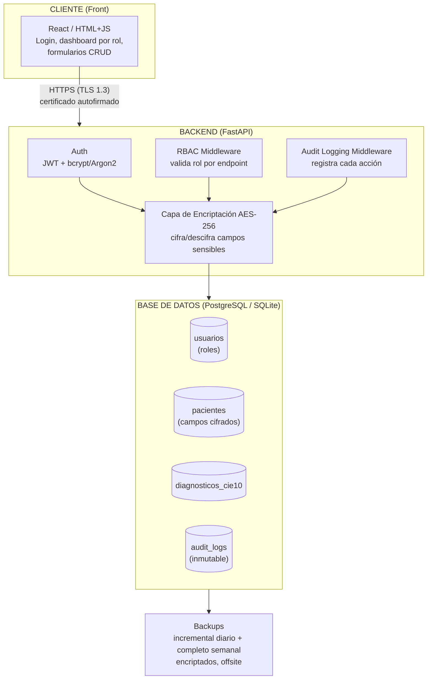
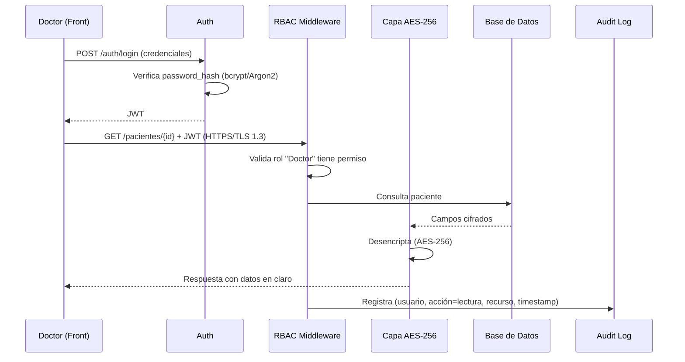
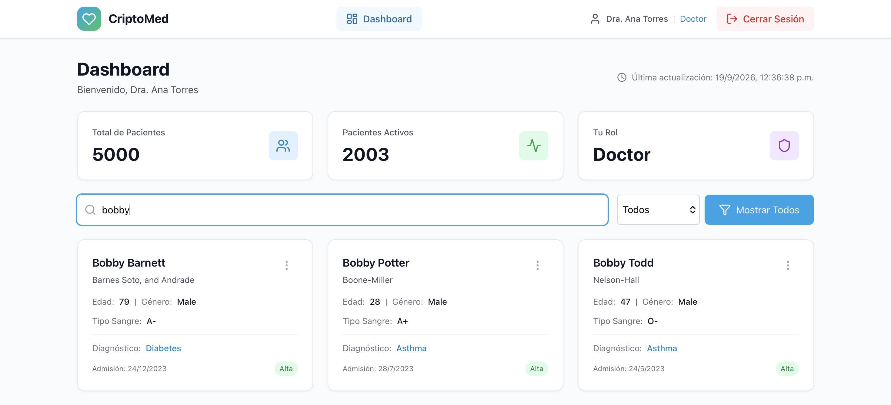
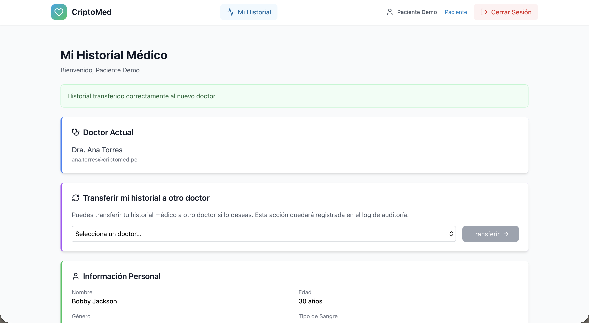
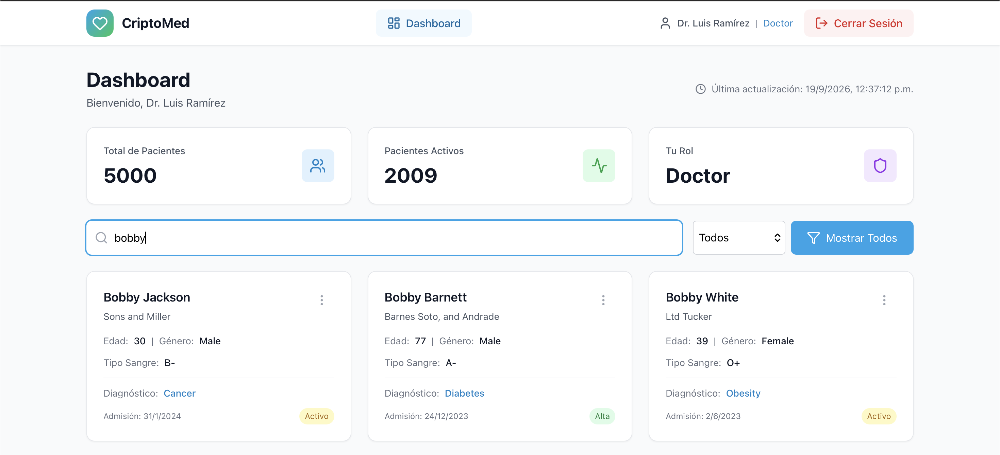
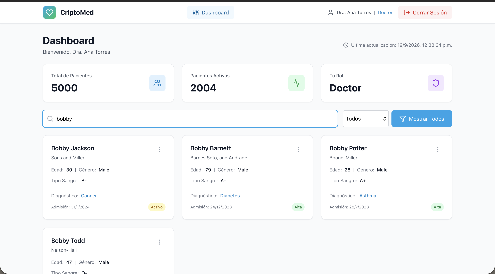
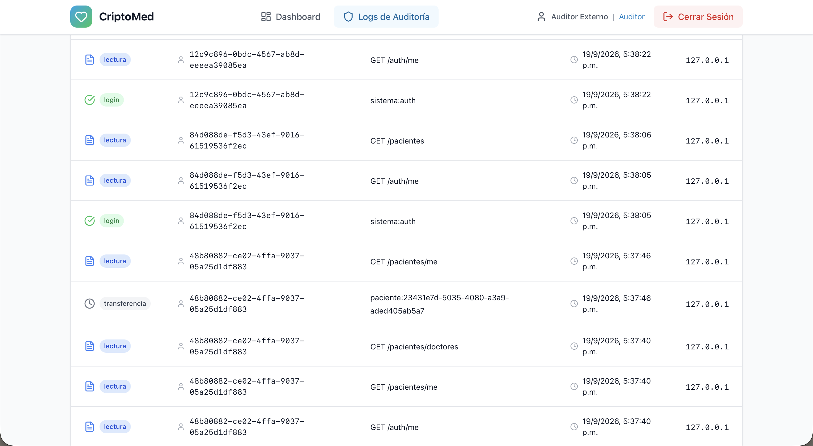
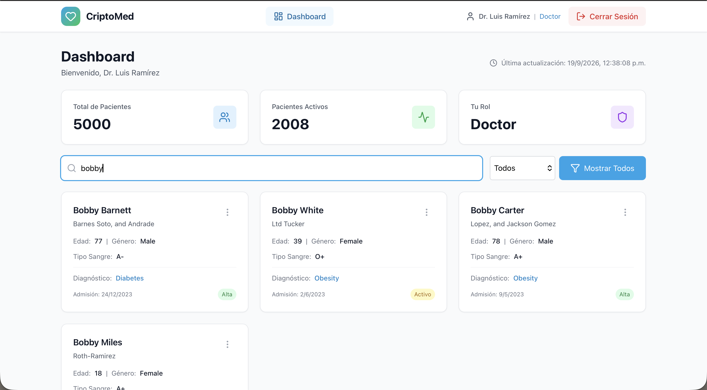

# CriptoMed
> Proyecto de Ética y Seguridad de los Datos – DS3031

Plataforma web que permite a clínicas pequeñas y consultorios independientes centralizar los historiales médicos de sus pacientes de forma segura, con acceso controlado por roles, datos encriptados en reposo y tránsito, y trazabilidad completa de cada acceso o modificación.

---

## Tabla de contenidos
- [Problema y motivación](#problema-y-motivación)
- [Caso de negocio](#caso-de-negocio)
- [KPIs / OKRs](#kpis--okrs)
- [Datasets](#datasets)
- [Arquitectura](#arquitectura)
- [Modelo de datos](#modelo-de-datos)
- [Roles y permisos](#roles-y-permisos)
- [Seguridad](#seguridad)
- [Stack técnico](#stack-técnico)
- [Estructura del repositorio](#estructura-del-repositorio)
- [Endpoints principales](#endpoints-principales)
- [Cumplimiento normativo](#cumplimiento-normativo)
- [Documentación](#documentación)
- [Recomendaciones futuras](#recomendaciones-futuras)

---

## Problema y motivación

Las clínicas pequeñas y consultorios independientes en Perú suelen manejar historiales médicos en papel o en hojas de Excel sin protección, lo que genera:

- Riesgo de pérdida de información crítica (sin backups)
- Acceso no controlado (cualquier personal puede ver cualquier historial)
- Incumplimiento de la **Ley N° 29733** (Ley de Protección de Datos Personales del Perú)
- Dificultad para auditar quién accedió a qué información y cuándo

## Caso de negocio

CriptoMed centraliza los historiales médicos en un sistema con **control de acceso basado en roles (RBAC)**, **encriptación de campos sensibles**, y **logs de auditoría inmutables**, permitiendo a la clínica operar de forma más rápida, segura y conforme a la normativa.

## KPIs / OKRs

| Objetivo | Key Result |
|---|---|
| Reducir el riesgo de exposición de datos sensibles | 100% de campos sensibles encriptados en reposo |
| | 0 incidentes de acceso no autorizado en 6 meses |
| Mejorar la eficiencia operativa | Reducir tiempo de acceso a un historial de ~10 min a < 30 seg |
| | 100% de accesos registrados en logs de auditoría |
| Cumplimiento normativo | 100% de requisitos de la Ley N° 29733 cubiertos |
| | Detectar accesos anómalos en < 24 horas (vs. promedio industria de 279 días — IBM Cost of a Data Breach Report 2025) |

## Datasets

| Dataset | Fuente | Uso |
|---|---|---|
| `healthcare_dataset.csv` | [Kaggle – prasad22/healthcare-dataset](https://www.kaggle.com/datasets/prasad22/healthcare-dataset) | Dataset principal: pacientes, admisiones, diagnósticos, facturación |
| `cie10.csv` | [Hugging Face – rubend18/CIE10](https://huggingface.co/datasets/rubend18/CIE10) | Normalización de diagnósticos a código CIE-10 estándar |
| `healthcare_dataset_mapped.csv` | Generado localmente | Dataset principal + FK `Codigo_CIE10` |

---

## Arquitectura



**Flujo de una petición típica (ej. Doctor consulta historial de un paciente):**




**Flujo de una petición típica (ej. Doctor consulta historial de un paciente):**
1. Front envía credenciales → Backend valida con bcrypt/Argon2 → emite JWT.
2. Front envía JWT en cada request sobre HTTPS.
3. Middleware RBAC valida que el rol "Doctor" tenga permiso sobre el endpoint solicitado.
4. Backend consulta la DB, desencripta los campos sensibles (AES-256) solo para la respuesta.
5. Middleware de auditoría registra: usuario, acción, timestamp, recurso, en `audit_logs` (append-only).
6. Front recibe y muestra la data.

## Modelo de datos

**`usuarios`**
| Campo | Tipo | Notas |
|---|---|---|
| id | UUID / PK | |
| nombre | string | |
| email | string, único | |
| password_hash | string | bcrypt/Argon2 |
| rol | enum | `admin`, `doctor`, `administrativo`, `auditor` |
| activo | boolean | para revocación de accesos |
| creado_en | timestamp | |

**`pacientes`**
| Campo | Tipo | Notas |
|---|---|---|
| id | UUID / PK | |
| nombre | string (cifrado AES-256) | |
| edad | int | |
| genero | string | |
| tipo_sangre | string | |
| diagnostico | string (cifrado AES-256) | |
| codigo_cie10 | FK → `diagnosticos_cie10` | |
| fecha_admision | date | |
| doctor_id | FK → `usuarios` | |
| hospital | string | |
| proveedor_seguro | string | |
| monto_facturado | decimal (cifrado AES-256) | |
| numero_habitacion | string | |
| tipo_admision | string | |
| fecha_alta | date | |
| medicacion | string (cifrado AES-256) | |
| resultado_test | string (cifrado AES-256) | |

**`diagnosticos_cie10`**
| Campo | Tipo |
|---|---|
| codigo | string / PK |
| descripcion | string |

**`audit_logs`** *(inmutable, solo-lectura salvo el sistema)*
| Campo | Tipo | Notas |
|---|---|---|
| id | UUID / PK | |
| usuario_id | FK → `usuarios` | |
| accion | enum | `login`, `lectura`, `edicion`, `borrado` |
| recurso | string | ej. `paciente:UUID` |
| timestamp | datetime | |
| ip_origen | string | |

## Roles y permisos

| Rol | Login | Ver pacientes | Ver diagnóstico/facturación | Editar pacientes | Gestionar usuarios | Ver audit logs |
|---|---|---|---|---|---|---|
| **Administrador** | ✅ | ✅ | ✅ | ✅ | ✅ | ✅ |
| **Doctor** | ✅ | ✅ (asignados) | ✅ (asignados) | ✅ (asignados) | ❌ | ❌ |
| **Administrativo** | ✅ | ✅ (datos básicos) | ✅ (facturación) | ✅ (admisión/facturación) | ❌ | ❌ |
| **Auditor** | ✅ | ❌ | ❌ | ❌ | ❌ | ✅ (solo lectura) |

## Seguridad

| Medida | Implementación |
|---|---|
| Encriptación en reposo | AES-256 sobre campos sensibles (diagnóstico, facturación, medicación, resultados de test) |
| Encriptación en tránsito | HTTPS con TLS 1.3, certificado digital autofirmado (OpenSSL) |
| Hashing de contraseñas | bcrypt o Argon2 |
| Autenticación | JWT con expiración + expiración de sesión por inactividad |
| Autorización | RBAC (4 roles), principio de mínimo privilegio |
| Auditoría | Logs inmutables de login/lectura/edición/borrado |
| Política de contraseñas | Mínimo 10 caracteres, mayúsculas/números/símbolos, rotación cada 90 días |
| Backups | Incremental diario + completo semanal, encriptados, offsite |
| RTO / RPO | RTO < 4h, RPO < 24h |
| Análisis de vulnerabilidades | OWASP ZAP (dinámico), Bandit (estático, Python), Safety (dependencias), npm audit (frontend) |
| Plan de incidentes | Detección → Contención → Notificación → Remediación → Post-mortem |

## Stack técnico

| Capa | Tecnología |
|---|---|
| Backend | Python + FastAPI |
| Base de datos | PostgreSQL (o SQLite para desarrollo local) |
| ORM | SQLAlchemy |
| Auth | JWT (`python-jose`) + `passlib[bcrypt]` |
| Encriptación | `cryptography` (Fernet / AES-256) |
| Front | React (o HTML/JS simple) |
| Certificados | OpenSSL (autofirmado) |
| Control de versiones | Git / GitHub |
| Informe | GitHub Pages o Notion |

## Desarrollo local (paso 1)

### Usar Docker para PostgreSQL

```bash
# iniciar postgresql en docker
docker compose up -d

# crear tablas en la base de datos
python3 backend/scripts/setup_db_docker.py

# iniciar backend
source .venv/bin/activate
cd backend && uvicorn app.main:app --reload --host 127.0.0.1 --port 8000
```

Comprobar: `curl http://127.0.0.1:8000/health` → `{"status":"ok",...}`  
Docs interactivas: http://127.0.0.1:8000/docs

## Estructura del repositorio

```
criptomed/
├── backend/
│   ├── app/
│   │   ├── main.py
│   │   ├── models.py          # usuarios, pacientes, diagnosticos_cie10, audit_logs
│   │   ├── schemas.py
│   │   ├── auth.py            # login, JWT, hashing
│   │   ├── rbac.py            # middleware de roles
│   │   ├── crypto.py          # cifrado/descifrado AES-256
│   │   ├── audit.py           # middleware de logging
│   │   └── routers/
│   │       ├── pacientes.py
│   │       ├── usuarios.py
│   │       └── audit_logs.py
│   ├── certs/                 # cert.pem, key.pem (autofirmados, NO subir a git)
│   ├── scripts/
│   │   ├── setup_db_docker.py # script de setup de base de datos
│   │   ├── seed_db.py         # script de carga de datos
│   │   ├── backup_db.sh       # script de backup de postgresql
│   │   ├── create_user.py     # script de creación de usuarios
│   │   ├── verificar_cifrado.py # script de verificación de cifrado
│   │   └── verificar_logs.py  # script de verificación de logs
│   ├── data/
│   │   ├── healthcare_dataset.csv
│   │   ├── cie10.csv
│   │   └── healthcare_dataset_mapped.csv
│   └── requirements.txt
├── frontend/
│   ├── src/
│   │   ├── pages/ (Login, Dashboard, PacienteDetalle, AuditLog)
│   │   ├── components/ (Layout)
│   │   ├── context/ (AuthContext)
│   │   └── App.jsx
│   └── package.json
├── docs/
│   ├── RECOVERY_PLAN.md               # plan de recuperación ante desastres
│   ├── HTTPS_CONFIGURATION.md         # configuración https (http vs https)
│   ├── PASSWORD_POLICY.md             # políticas de contraseñas
│   ├── USER_MANAGEMENT.md             # procedimientos de gestión de usuarios
│   ├── SECURITY_AWARENESS.md          # concientización y formación del equipo
│   ├── INCIDENT_RESPONSE.md           # plan de respuesta ante incidentes
│   ├── NOTIFICATION_PROCEDURES.md     # procedimientos de notificación
│   ├── MITIGATION_PROCEDURES.md       # procedimientos de mitigación
│   ├── FUTURE_RECOMMENDATIONS.md      # recomendaciones futuras de seguridad
│   └── FINAL_REPORT.md                # informe final completo
├── data/
│   ├── cie10.csv
│   └── healthcare_dataset_mapped.csv
├── docker-compose.yml
├── .env
├── .env.example
├── .gitignore
├── README.md
└── SETUP_GUIDE.md
```

## Endpoints principales

| Método | Ruta | Rol requerido | Descripción |
|---|---|---|---|
| POST | `/auth/login` | público | Login, retorna JWT |
| GET | `/pacientes` | doctor, admin, administrativo | Lista pacientes (campos según rol) |
| GET | `/pacientes/{id}` | doctor (asignado), admin | Detalle completo |
| POST | `/pacientes` | admin, administrativo | Crear paciente/admisión |
| PUT | `/pacientes/{id}` | doctor (asignado), admin | Editar historial |
| DELETE | `/pacientes/{id}` | admin | Borrado (soft-delete) |
| GET | `/usuarios` | admin | Gestión de usuarios |
| POST | `/usuarios` | admin | Crear usuario |
| PATCH | `/usuarios/{id}/revocar` | admin | Revocar acceso |
| GET | `/audit-logs` | auditor, admin | Consultar logs (solo lectura) |
| GET | `/pacientes/me` | paciente | Ver propio historial |
| GET | `/pacientes/doctores` | paciente, admin | Lista doctores disponibles |
| PATCH | `/pacientes/{id}/transferir-doctor` | paciente (propio), admin | Transferir paciente a otro doctor |

## Plan de Recuperación ante Desastres

El sistema tiene un plan completo de recuperación ante desastres documentado en `docs/RECOVERY_PLAN.md` que incluye:

**Tipos de desastres considerados:**
- Fuga de datos (acceso no autorizado, exposición de credenciales)
- Pérdida de datos (fallo de hardware, corrupción de base de datos)
- Ataque de ransomware

**Procedimientos de recuperación:**
- **RTO (Recovery Time Objective):** < 4 horas
- **RPO (Recovery Point Objective):** < 24 horas
- Backups incrementales diarios + completos semanales
- Backups encriptados y almacenados offsite
- Procedimientos paso a paso para restauración desde backup
- Plan de comunicación y notificación a ARDA (Autoridad Nacional de Protección de Datos Personales)

**Backup strategy:**
- Incremental diario: Copia de cambios desde el último backup
- Completo semanal: Copia completa de toda la base de datos
- Encriptación: Backups encriptados con AES-256
- Offsite: Almacenados en ubicación separada del servidor principal
- Retención: Backups retenidos por 90 días para cumplimiento normativo

**Para más detalles:** Ver el documento completo en `docs/RECOVERY_PLAN.md`

## Cumplimiento normativo

- **Ley N° 29733** – Ley de Protección de Datos Personales del Perú (aplicación directa: datos de salud = datos sensibles).
- Referencia complementaria: principios de **HIPAA** (EE.UU.), dado que la estructura del dataset base sigue ese estándar.

## Documentación

Toda la documentación detallada del proyecto se encuentra en la carpeta `/docs/`:

**Documentación de Seguridad:**
- `docs/RECOVERY_PLAN.md` - Plan de recuperación ante desastres
- `docs/HTTPS_CONFIGURATION.md` - Configuración HTTPS (HTTP vs HTTPS)
- `docs/PASSWORD_POLICY.md` - Políticas de contraseñas
- `docs/USER_MANAGEMENT.md` - Procedimientos de gestión de usuarios
- `docs/SECURITY_AWARENESS.md` - Concientización y formación del equipo
- `docs/INCIDENT_RESPONSE.md` - Plan de respuesta ante incidentes
- `docs/NOTIFICATION_PROCEDURES.md` - Procedimientos de notificación
- `docs/MITIGATION_PROCEDURES.md` - Procedimientos de mitigación
- `docs/FUTURE_RECOMMENDATIONS.md` - Recomendaciones futuras de seguridad

**Documentación de Proyecto:**
- `docs/FINAL_REPORT.md` - Informe final completo (diseño, motivación, trasfondo teérico, requerimientos, implementación, lecciones aprendidas, retrospectiva)

**Documentación de Setup:**
- `SETUP_GUIDE.md` - Guía de setup del proyecto
- `README.md` - Este archivo

**Capturas de Pantalla:**
- `docs/images/login.png` - Pantalla de login
- `docs/images/admin_sistema_dashboard.png` - Dashboard del admin
- `docs/images/admin_sistema_logs.png` - Logs de auditoría del admin
- `docs/images/admin_clinica_dashboard.png` - Dashboard del administrativo
- `docs/images/doctor_dashboard.png` - Dashboard del doctor
- `docs/images/auditor_dashboard_denegado.png` - Auditor sin acceso a dashboard
- `docs/images/auditor_logs.png` - Logs de auditoría del auditor
- `docs/images/JWT_logs.png` - Headers JWT en Network tab
- `docs/images/ana_no_bobby.png` - Doctor A (Ana Torres) no ve paciente demo
- `docs/images/bobby_tranfiere_ana.png` - Paciente demo transfiere de Doctor A a Doctor B
- `docs/images/luis_si_bobby.png` - Doctor B (Luis Ramírez) ahora sí ve paciente demo
- `docs/images/ana_ahora_si_bobby.png` - Doctor A (Ana Torres) ya no ve paciente demo
- `docs/images/logs_transferencia.png` - Log de auditoría de transferencia
- `docs/images/luis_ya_no_bobby.png` - Doctor B (Luis Ramírez) ya no ve paciente demo después de transferencia

**Scripts:**
- `backend/scripts/backup_db.sh` - Script de backup de PostgreSQL

## Recomendaciones futuras

- Autenticación multifactor (MFA) para todos los roles
- Migrar de certificado autofirmado a CA reconocida en producción
- Cifrado a nivel de columna con rotación periódica de llaves (key rotation)
- Web Application Firewall (WAF) delante del backend
- Anonimización/seudonimización de datos en entornos de prueba

---

## Despliegue en la nube

### Frontend (GitHub Pages)

El frontend está desplegado en GitHub Pages: https://maffzz.github.io/cripto-med/

**Despliegue automático:**
- Cada push a la rama `main` activa el despliegue
- El build se realiza automáticamente con `npm run build`
- Los archivos estáticos se publican en GitHub Pages

### Backend (Render)

El backend está configurado para desplegarse en Render usando `render.yaml`.

**Pasos para desplegar:**

1. **Crear cuenta en Render:** https://render.com/

2. **Conectar repositorio:**
   - Click en "New +"
   - "Web Service"
   - Conectar tu repositorio de GitHub
   - Render detectará automáticamente el archivo `render.yaml`

3. **Configurar variables de entorno:**
   - Render configurará automáticamente `DATABASE_URL` (PostgreSQL)
   - `JWT_SECRET` (generado automáticamente)
   - `ENCRYPTION_KEY` (generado automáticamente)
   - `USE_HTTPS` = "true"

4. **Ejecutar scripts de setup:**
   - Render ejecutará automáticamente los scripts de setup
   - Las tablas se crearán automáticamente
   - Los datos se cargarán automáticamente

5. **Actualizar frontend:**
   - La URL del backend será: `https://criptomed-backend.onrender.com`
   - Esta URL ya está configurada en `frontend/.env.production`

**Documentación de Render:**
- Archivo de configuración: `render.yaml`
- Scripts de setup: `backend/scripts/setup_db_render.py`, `backend/scripts/seed_db_render.py`
- Base de datos: PostgreSQL gratuito en Render

**Nota:**
- El plan gratuito de Render tiene limitaciones (spindown después de 15 min de inactividad)
- Para producción se recomienda usar un plan de pago

---

## Extensión: Login de Paciente y Transferencia de Doctor

### Auto-Gestión de Accesos por Parte del Paciente

Además del control de accesos basado en roles, se implementó un mecanismo de auto-gestión de accesos por parte del paciente: el paciente puede transferir el acceso a su historial médico de un doctor a otro directamente desde su cuenta, sin intervención de un administrador. Esta funcionalidad refuerza el principio de mínimo privilegio (solo el doctor actualmente asignado tiene acceso al historial completo) y se alinea con los derechos de los titulares de datos personales reconocidos en la **Ley N° 29733** (Ley de Protección de Datos Personales del Perú), donde el paciente mantiene control sobre quién accede a su información sensible.

**Implementación:**
- Nuevo rol `paciente` en el sistema
- Endpoint `GET /pacientes/me` para que el paciente vea su propio historial
- Endpoint `PATCH /pacientes/{id}/transferir-doctor` para transferir a otro doctor
- Endpoint `GET /pacientes/doctores` para listar doctores disponibles
- Campo `usuario_id` en el modelo `Paciente` para vincular la cuenta del paciente con su historial médico
- Nueva acción `transferencia` en el enum de auditoría
- Campo `detalle` en `AuditLog` para guardar el doctor anterior y el nuevo doctor

**Permisos del Rol Paciente:**
- Solo puede leer su propio historial médico (`GET /pacientes/me`)
- Puede transferir su historial a otro doctor disponible
- No puede ver otros pacientes
- No puede ver logs de auditoría
- No puede editar diagnóstico o medicación (solo transferir el acceso)

**Seguridad:**
- La transferencia solo puede ser ejecutada por:
  - El propio paciente (self-service)
  - Un administrador (por seguridad en caso de emergencia)
- Cada transferencia queda registrada en el log de auditoría con:
  - Usuario que ejecutó la acción
  - Timestamp exacto
  - Doctor anterior (UUID)
  - Doctor nuevo (UUID)
  - IP de origen

**Demostración:**
El flujo completo se puede demostrar en vivo:
1. Login como Doctor A → muestra sus pacientes asignados
2. Login como Doctor B → NO ve al paciente demo (asignado al Doctor A)
3. Login como Paciente Demo → ve su historial con Doctor A asignado
4. Paciente transfiere a Doctor B → acción registrada en logs
5. Login como Doctor B → AHORA SÍ ve al paciente demo
6. Login como Doctor A → YA NO ve al paciente demo
7. Login como Auditor → log de auditoría muestra la transferencia con detalles completos

**Evidencia Visual:**













### Derechos ARCO y Auto-Gestión

La funcionalidad de transferencia de doctor por parte del paciente se alinea directamente con los derechos ARCO (Acceso, Rectificación, Cancelación, Oposición) reconocidos en la Ley N° 29733. Específicamente, refuerza el derecho de **Acceso** (el paciente puede ver su propio historial) y el derecho de **Oposición** (el paciente puede controlar quién accede a su información). Esto demuestra que el sistema no solo protege los datos sensibles, sino que también empodera al titular de los datos para ejercer control sobre su información.

### Flujo de Transferencia de Doctor

```
┌─────────────┐
│  Paciente   │
│  (Login)    │
└──────┬──────┘
       │
       │ GET /pacientes/me
       │
       ▼
┌─────────────────┐
│  Mi Historial   │
│  (Frontend)    │
└──────┬──────────┘
       │
       │ PATCH /pacientes/{id}/transferir-doctor
       │ (nuevo_doctor_id)
       │
       ▼
┌─────────────────┐
│  Backend FastAPI│
│  - Verifica     │
│    permisos     │
│  - Actualiza    │
│    doctor_id    │
│  - Registra     │
│    en audit_log │
└──────┬──────────┘
       │
       │
       ▼
┌─────────────────┐
│  Doctor A       │
│  (Pierde acceso)│
└─────────────────┘

┌─────────────────┐
│  Doctor B       │
│  (Gana acceso)  │
└─────────────────┘

┌─────────────────┐
│  Audit Log      │
│  (Registra      │
│   transferencia)│
└─────────────────┘
```

### Mejoras en la Auto-Gestión del Paciente (Recomendaciones Futuras)
- Implementar notificaciones al doctor cuando un paciente transfiere su historial
- Agregar historial de transferencias (timeline de cambios de doctor)
- Implementar revocación de transferencia (undo) dentro de un período de tiempo
- Agregar aprobación del doctor antes de aceptar transferencia
- Implementar consentimiento explícito del paciente para cada acceso