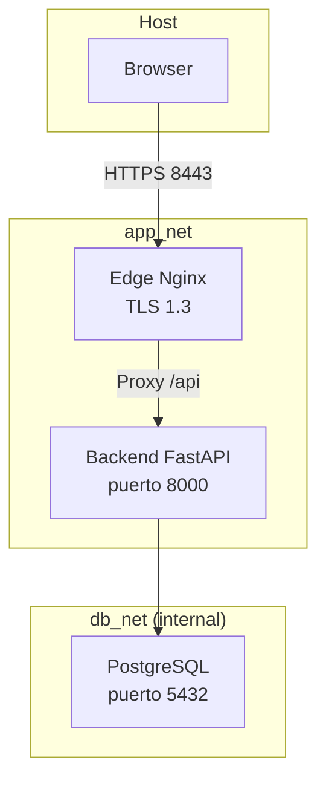

# CriptoMed
> Proyecto de Ética y Seguridad de los Datos – DS3031 (Entrega 2)

Plataforma web que permite a clínicas pequeñas y consultorios independientes centralizar los historiales médicos de sus pacientes de forma segura, con acceso controlado por roles, datos cifrados en reposo con AES-256-GCM, encriptación en tránsito con TLS 1.3, y trazabilidad completa mediante logs de auditoría inmutables con cadena de hashes SHA-256.

**Despliegue:** Docker Compose local con PostgreSQL 16, FastAPI (Python 3.12.7), React (Vite + Node 20.19.0) y Nginx 1.27 con TLS 1.3.

**Estado:** Fase 4 completada (informe reescrito como narrativa de diseño con verificación de herramientas, DPIA y consideraciones éticas).

---

## Cómo ejecutar el proyecto

**Requisitos:** Docker y Docker Compose.

1. **Generar .env:** `python3 scripts/generate_secrets.py --generate-env`
2. **Generar certificados:** `./scripts/gen_cert.sh`
3. **Levantar servicios:** `./scripts/dev.sh up`
4. **Sembrar datos de demo:** `./scripts/dev.sh seed`
5. **Abrir aplicación:** https://localhost:8443 (aceptar certificado autofirmado o importar `certs/cert.pem` como confiable)
6. **Usuarios demo:**
   - admin@criptomed.local (DEMO_PASSWORD_ADMIN)
   - doctor1@criptomed.local (DEMO_PASSWORD_DOCTOR)
   - admin1@criptomed.local (DEMO_PASSWORD_ADMINISTRATIVO)
   - auditor1@criptomed.local (DEMO_PASSWORD_AUDITOR)
   - paciente1@criptomed.local (DEMO_PASSWORD_PACIENTE)
   - Contraseña para todos: admin123

**Para reiniciar desde cero:** `./scripts/dev.sh reset`

**Para verificar despliegue:** `./scripts/verificar_despliegue.sh`

---

## Arquitectura Docker


```mermaid
graph TB
    subgraph "Host"
        A[Browser]
    end
    
    subgraph "app_net"
        B[Edge Nginx<br/>TLS 1.3]
        C[Backend FastAPI<br/>puerto 8000]
    end
    
    subgraph "db_net (internal)"
        D[PostgreSQL<br/>puerto 5432]
    end
    
    A -->|HTTPS 8443| B
    B -->|Proxy /api| C
    C --> D
```

**Servicios Docker:**
- **db**: PostgreSQL 16 Alpine - Base de datos con healthcheck, roles (owner y aplicación)
- **backend**: FastAPI con Python 3.12.7 - API REST con healthcheck, usuario no root (UID 10001), filesystem de solo lectura
- **edge**: Nginx 1.27 Alpine - Terminación TLS 1.3 exclusivo, frontend React compilado, proxy a backend
- **init**: Servicio de inicialización (perfil seed) - Crea tablas y carga datos demo
- **backup**: Servicio de backups (perfil tools) - pg_dump + GPG AES-256

**Redes:**
- `app_net`: Frontend y backend (no internal para exponer puerto 8443 al host)
- `db_net`: Base de datos (internal, solo accesible desde backend)

**Puertos:**
- Solo edge publica puerto `8443:8443` al host
- Puertos 5432 (Postgres) y 8000 (backend) son internos, no expuestos

---

## Modelo de datos

**`usuarios`**

| Campo | Tipo | Notas |
|---|---|---|
| id | UUID / PK | |
| nombre | string | |
| email | string, único | |
| password_hash | string | bcrypt (factor 12) |
| rol | enum | `admin`, `doctor`, `administrativo`, `auditor`, `paciente` |
| activo | boolean | para revocación inmediata de accesos |
| intentos_fallidos | integer | contador para bloqueo por fuerza bruta |
| bloqueado_hasta | datetime | timestamp de fin de bloqueo temporal |
| creado_en | timestamp | |

**`pacientes`**

| Campo | Tipo | Notas |
|---|---|---|
| id | UUID / PK | |
| nombre | string (cifrado AES-256-GCM) | AAD: pacientes.nombre.{id} |
| edad | integer | |
| genero | string | |
| tipo_sangre | string | |
| diagnostico | string (cifrado AES-256-GCM) | AAD: pacientes.diagnostico.{id} |
| codigo_cie10 | string, FK → diagnosticos_cie10 | |
| fecha_admision | datetime | |
| doctor_id | UUID, FK → usuarios | médico asignado |
| usuario_id | UUID, FK → usuarios (opcional) | cuenta de login del paciente |
| hospital | string | |
| proveedor_seguro | string | |
| monto_facturado | string (cifrado AES-256-GCM) | AAD: pacientes.monto_facturado.{id} |
| numero_habitacion | string | |
| tipo_admision | string | |
| fecha_alta | datetime | |
| medicacion | string (cifrado AES-256-GCM) | AAD: pacientes.medicacion.{id} |
| resultado_test | string (cifrado AES-256-GCM) | AAD: pacientes.resultado_test.{id} |
| consentimiento_fecha | datetime | fecha de consentimiento informado |
| consentimiento_version | string | versión del documento de consentimiento |

**`diagnosticos_cie10`**

| Campo | Tipo |
|---|---|
| codigo | string / PK |
| descripcion | string |

**`audit_logs`** *(inmutable, cadena SHA-256, solo INSERT/SELECT para rol de aplicación)*

| Campo | Tipo | Notas |
|---|---|---|
| id | UUID / PK | |
| seq | BigInteger (autoincremental, único) | para orden cronológico |
| hash_prev | string (64) | hash SHA-256 del registro anterior |
| hash_actual | string (64) | hash SHA-256 del registro actual |
| usuario_id | UUID, FK → usuarios (nullable) | |
| accion | enum | `login`, `login_fallido`, `bloqueo`, `lectura`, `edicion`, `borrado`, `transferencia`, `exportacion`, `acceso_emergencia` |
| recurso | string | ej. `paciente:UUID` |
| timestamp | datetime | UTC |
| ip_origen | string | |
| detalle | string (nullable) | detalle adicional |

**`accesos_emergencia`** *(break-glass)*

| Campo | Tipo | Notas |
|---|---|---|
| id | UUID / PK | |
| paciente_id | UUID, FK → pacientes | |
| doctor_id | UUID, FK → usuarios | |
| justificacion | string | mínimo 20 caracteres |
| otorgado_en | datetime | |
| expira_en | datetime | ventana de 30 minutos |

---

## Roles y permisos

| Rol | Login | Ver pacientes | Ver diagnóstico | Editar pacientes | Gestionar usuarios | Ver audit logs |
|---|---|---|---|---|---|---|
| **Administrador** | ✅ | ✅ | ✅ | ✅ | ✅ | ✅ |
| **Doctor** | ✅ | ✅ (asignados) | ✅ (asignados) | ✅ (asignados) | ❌ | ❌ |
| **Administrativo** | ✅ | ✅ (datos básicos) | ❌ | ✅ (admisión/facturación) | ❌ | ❌ |
| **Auditor** | ✅ | ❌ | ❌ | ❌ | ❌ | ✅ (solo lectura) |
| **Paciente** | ✅ | ✅ (propio) | ✅ (propio) | ❌ | ❌ | ❌ (solo accesos propios) |

**Nota:** El rol administrativo NO ve diagnóstico, medicación ni resultado_test (Paso 0.3). El rol paciente puede ver sus accesos y exportar sus datos (Paso 1.7).

---

## Seguridad

| Medida | Implementación | Estándar |
|---|---|---|
| Cifrado en reposo | AES-256-GCM con llaves versionadas (v1, v2) y AAD sobre campos sensibles (nombre, diagnóstico, medicación, resultado_test, monto_facturado) | FIPS 197, NIST SP 800-38D |
| Cifrado en tránsito | TLS 1.3 exclusivo en edge Nginx, certificado autofirmado (OpenSSL) | RFC 8446, NIST SP 800-52 Rev. 2 |
| Hashing de contraseñas | bcrypt factor 12, política NIST SP 800-63B (sin composición obligatoria, sin expiración periódica) | OWASP Password Storage Cheat Sheet, NIST SP 800-63B |
| Autenticación | JWT HS256 con expiración 30 min, verificación de activo y bloqueado_hasta en cada request | RFC 7519, RFC 8725 |
| Autorización | RBAC (5 roles), principio de mínimo privilegio, filtrado en backend (no solo frontend) | NIST SP 800-63B, OWASP ASVS |
| Auditoría | Logs inmutables con cadena SHA-256, pg_advisory_xact_lock, triggers anti-UPDATE/DELETE, rol de aplicación con solo INSERT/SELECT | NIST SP 800-92, OWASP Logging Cheat Sheet |
| Bloqueo por fuerza bruta | Bloqueo tras 5 intentos fallidos (15 min), rate limiting 10 req/min por IP (slowapi) | NIST SP 800-63B |
| Usuario no root | Contenedores backend e init corren como UID 10001 | CIS Docker Benchmark 4.1 |
| Capabilities mínimas | `cap_drop: ALL` + `cap_add` de solo las necesarias (NET_BIND_SERVICE, CHOWN, etc.) | CIS Docker Benchmark 5.26 |
| No secretos en imágenes | Variables de entorno vía docker-compose.yml, no COPY de .env, certificados en volumen de solo lectura | CIS Docker Benchmark 4.1, OWASP ASVS V7.2.1 |
| Healthchecks | pg_isready (db), /health endpoint (backend) | CIS Docker Benchmark 6.1 |
| Límites de recursos | mem_limit y pids_limit configurados en docker-compose.yml | CIS Docker Benchmark 5.17 |
| Filesystem read-only | Backend e init con read_only: true, tmpfs para /tmp | CIS Docker Benchmark 5.15 |
| Redes internas | db_net: internal (solo backend accede a PostgreSQL) | CIS Docker Benchmark 5.8 |
| Cabeceras de seguridad | HSTS, X-Content-Type-Options, X-Frame-Options, Referrer-Policy, CSP, Cross-Origin-Resource-Policy | OWASP ASVS V7 |

Para más detalles de hardening, ver `docs/HARDENING_DOCKER.md`.

---

## Endpoints principales

| Método | Ruta | Rol requerido | Descripción |
|---|---|---|---|
| POST | `/api/auth/login` | público | Login, retorna JWT |
| GET | `/api/pacientes` | doctor, admin, administrativo | Lista pacientes (campos según rol) |
| GET | `/api/pacientes/{id}` | doctor (asignado), admin | Detalle completo |
| POST | `/api/pacientes` | admin, administrativo | Crear paciente |
| PUT | `/api/pacientes/{id}` | doctor (asignado), admin | Editar historial |
| DELETE | `/api/pacientes/{id}` | admin | Borrado |
| GET | `/api/usuarios` | admin | Gestión de usuarios |
| POST | `/api/usuarios` | admin | Crear usuario |
| PATCH | `/api/usuarios/{id}/revocar` | admin | Revocar acceso |
| GET | `/api/audit-logs` | auditor, admin | Consultar logs (solo lectura) |
| GET | `/api/audit-logs/alertas` | auditor, admin | Alertas de accesos anómalos |
| GET | `/api/pacientes/me` | paciente | Ver propio historial |
| GET | `/api/pacientes/me/accesos` | paciente | Lista de accesos a su historial |
| GET | `/api/pacientes/me/export` | paciente | Exportar sus datos (JSON) |
| GET | `/api/pacientes/doctores` | paciente, admin | Lista doctores disponibles |
| PATCH | `/api/pacientes/{id}/transferir-doctor` | paciente (propio), admin | Transferir paciente a otro doctor |
| POST | `/api/pacientes/{id}/acceso-emergencia` | doctor | Acceso de emergencia (break-glass) |

---

## Documentación

- `docs/DOCKER.md` - Documentación de Docker (diagramas, puertos, volúmenes, debugging)
- `docs/HARDENING_DOCKER.md` - Resumen de hardening Docker con tabla de controles (CIS, OWASP)
- `docs/FINAL_REPORT.md` - Informe final completo (narrativa de diseño, verificación con herramientas, DPIA, consideraciones éticas, lecciones aprendidas)
- `docs/inventario_datos.md` - Inventario completo de datos (45 campos, categorías, cifrado, roles)
- `docs/DPIA.md` - Evaluación de Impacto en la Protección de Datos (DPIA) completa
- `docs/flujo_datos.mmd` - Diagrama de flujo de datos Mermaid
- `docs/etica_privacidad.md` - Consideraciones éticas y privacidad
- `docs/hallazgos.md` - Registro de hallazgos de seguridad (escaneo inicial)
- `docs/comparativa_antes_despues.md` - Comparativa de escaneos antes/después de remediación

---

## Stack técnico

| Capa | Tecnología | Versión |
|---|---|---|
| Backend | Python + FastAPI | 3.12.7 |
| Base de datos | PostgreSQL | 16 Alpine |
| ORM | SQLAlchemy | - |
| Auth | JWT (`python-jose`) + `bcrypt` | HS256, factor 12 |
| Encriptación | `cryptography` (AES-256-GCM) | - |
| Frontend | React + Vite | Node 20.19.0 |
| Edge | Nginx | 1.27 Alpine |
| Orquestación | Docker Compose | - |
| Control de versiones | Git / GitHub | - |

---

## Scripts de operación

- `./scripts/dev.sh up` - Genera certificados si faltan, valida .env, build y levanta servicios
- `./scripts/dev.sh seed` - Ejecuta el perfil seed (carga datos demo)
- `./scripts/dev.sh down` - Detiene servicios
- `./scripts/dev.sh reset` - down -v + up + seed
- `./scripts/dev.sh logs` - Muestra logs de servicios
- `./scripts/dev.sh ps` - Muestra estado de servicios
- `./scripts/dev.sh test` - Ejecuta pytest en backend
- `./scripts/dev.sh shell-db` - Abre psql en contenedor db
- `./scripts/verificar_despliegue.sh` - Verifica 8 puntos críticos del despliegue (TLS 1.3, puertos internos, healthchecks, login, usuario no root, sin secretos en imágenes, sin secretos en config, reset)
- `./scripts/security_scan.sh` - Ejecuta suite multi-herramienta (Bandit, pip-audit, npm audit, Gitleaks, Hadolint, Trivy, testssl.sh, OWASP ZAP)
- `./scripts/rotate_keys.py` - Rotación de llaves de cifrado (con --dry-run)

---

## Estructura del repositorio

```
cripto-med/
├── backend/
│   ├── app/
│   │   ├── main.py
│   │   ├── models.py
│   │   ├── schemas.py
│   │   ├── auth.py
│   │   ├── rbac.py
│   │   ├── crypto.py
│   │   ├── audit.py
│   │   └── routers/
│   │       ├── auth.py
│   │       ├── usuarios.py
│   │       ├── pacientes.py
│   │       └── audit_logs.py
│   ├── scripts/
│   │   ├── setup_db_docker.py
│   │   ├── seed_db.py
│   │   ├── rotate_keys.py
│   │   ├── verificar_cifrado.py
│   │   └── verificar_cadena_logs.py
│   ├── scripts/sql/
│   │   └── proteger_audit_logs.sql
│   ├── requirements.txt
│   └── .dockerignore
├── frontend/
│   ├── src/
│   ├── package.json
│   └── vite.config.js
├── docker/
│   ├── backend/Dockerfile
│   ├── edge/Dockerfile
│   ├── edge/nginx.conf
│   ├── backup/Dockerfile
│   └── db/init/
│       ├── 02-create-tables.sql
│       └── 03-seed.sql
├── scripts/
│   ├── dev.sh
│   ├── dev.ps1
│   ├── gen_cert.sh
│   ├── generate_secrets.py
│   ├── generate_keys.py
│   ├── rotate_keys.py
│   ├── security_scan.sh
│   └── verificar_despliegue.sh
├── docs/
│   ├── DOCKER.md
│   ├── HARDENING_DOCKER.md
│   ├── FINAL_REPORT.md
│   ├── inventario_datos.md
│   ├── DPIA.md
│   ├── flujo_datos.mmd
│   ├── etica_privacidad.md
│   ├── hallazgos.md
│   └── comparativa_antes_despues.md
├── reports/
│   ├── before/
│   └── after/
├── certs/
│   ├── cert.pem
│   └── key.pem
├── docker-compose.yml
├── .env.example
├── .dockerignore
└── README.md
```

---

## Verificación de despliegue

El script `./scripts/verificar_despliegue.sh` verifica:

1. ✅ HTTPS://localhost:8443 responde con TLS 1.3 negociado
2. ✅ Puertos 5432 (Postgres) y 8000 (backend) NO son expuestos por Docker
3. ✅ Todos los servicios (db, backend, edge) están healthy/up
4. ✅ Login con usuario demo funciona a través de https://localhost:8443/api/auth/login
5. ✅ Backend corre con UID 10001 (usuario no root)
6. ✅ No hay .env ni *.pem en las imágenes Docker
7. ✅ docker compose config no contiene secretos literales
8. ✅ Reset completo disponible mediante `./scripts/dev.sh reset`

---

## Verificación de seguridad

El script `./scripts/security_scan.sh` ejecuta:

- **Bandit** (SAST Python) - Patrones inseguros en código
- **pip-audit** (SCA Backend) - Vulnerabilidades en dependencias Python
- **npm audit** (SCA Frontend) - Vulnerabilidades en dependencias JavaScript
- **Gitleaks** (Secretos) - Credenciales en repo e historial
- **Hadolint** (Dockerfile Linter) - Buenas prácticas Docker
- **Trivy** (Vulnerabilidades) - Escaneo de imágenes y filesystem
- **testssl.sh** (TLS DAST) - Configuración TLS del servidor
- **OWASP ZAP** (DAST) - Inyección, headers, CORS, configuración

Resultados tras remediación (Fase 2):
- Reducción del 61.18% en hallazgos (3,596 → 1,396)
- Todas las vulnerabilidades de severidad alta/media en código propio corregidas
- 0 vulnerabilidades en frontend directo
- 0 fugas de secretos en repo

---

## Cumplimiento normativo

- **Ley N° 29733** – Ley de Protección de Datos Personales del Perú
  - Art. 3: Datos de salud = datos sensibles ✅
  - Art. 5: Medidas técnicas (cifrado, hashing, control de acceso) ✅
  - Art. 10: Notificación de incidentes a ANPD (48h) ✅
  - Art. 14: Derechos ARCO (acceso, portabilidad, control) ✅
- **Reglamento D.S. 016-2024-JUS** – Reglamento de la Ley 29733 [VERIFICAR]
- **ANPD** – Autoridad Nacional de Protección de Datos Personales
- **GDPR Art. 35** – Evaluación de Impacto en la Protección de Datos (DPIA) ✅
- **ISO/IEC 29134** – Guía para evaluación de impacto en privacidad ✅
- **NIST SP 800-38D** – Recomendación para modo GCM (AES-256) ✅
- **NIST SP 800-63B** – Directrices de autenticación y contraseña ✅
- **NIST SP 800-92** – Guía de logging ✅
- **RFC 8446** – TLS 1.3 ✅
- **RFC 7519** – JWT ✅
- **RFC 8725** – JWT Best Current Practices ✅
- **OWASP ASVS** – Application Security Verification Standard ✅
- **CIS Docker Benchmark** – Benchmarks para contenedores ✅
- **OWASP Docker Security Cheat Sheet** – Guía de seguridad Docker ✅
- **OWASP Password Storage Cheat Sheet** – Almacenamiento de contraseñas ✅
- **OWASP Logging Cheat Sheet** – Logging best practices ✅

---

## Evolución del proyecto

**Entrega 1:** Sistema desplegado en Render (backend) y GitHub Pages (frontend), cifrado con Fernet (AES-128-CBC + HMAC).

**Entrega 2:**
- Migración a despliegue local con Docker Compose para control de aislamiento de red, terminación TLS y gestión de llaves
- Migración de Fernet a AES-256-GCM con llaves versionadas (FIPS 197, NIST SP 800-38D)
- Implementación de cadena de hashes SHA-256 en logs de auditoría (NIST SP 800-92)
- Implementación de bloqueo por fuerza bruta y rate limiting (NIST SP 800-63B)
- Verificación con herramientas de seguridad (reducción 61.18% en hallazgos)
- DPIA completa con 12 riesgos identificados
- Consideraciones éticas y privacidad (autonomía del paciente, break-glass, transparencia IA)
- Informe reescrito como narrativa de diseño (no checklist)

---

## Créditos

**Estudiante:** María Lazon  
**Curso:** DS3031 - Ética y Seguridad de Datos  
**Profesor:** [Nombre del profesor]  
**Fecha:** Noviembre 2026
