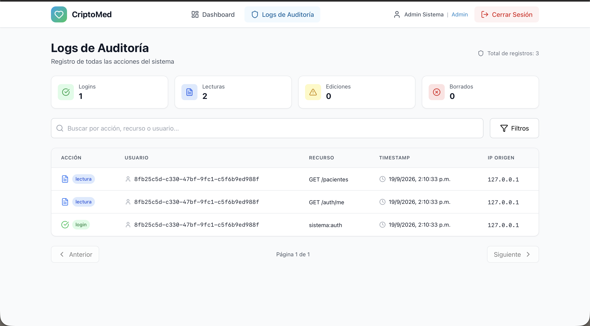
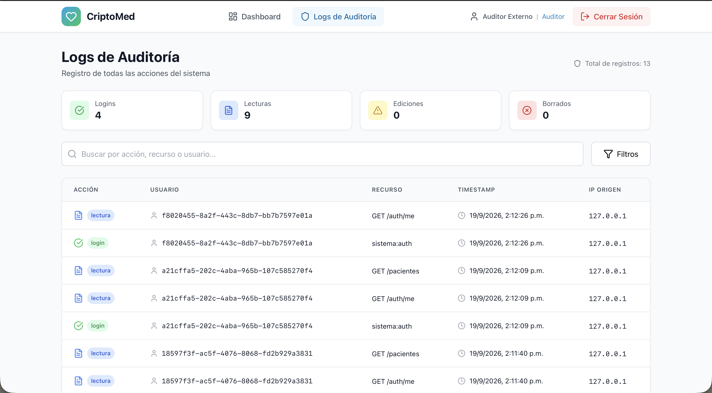

# Plan de Respuesta ante Incidentes de Seguridad - CriptoMed

## Resumen Ejecutivo
Este documento describe el plan de respuesta ante incidentes de seguridad para el sistema CriptoMed, enfocado en fugas de datos de pacientes.

## 1. Clasificación de Incidentes

### 1.1 Niveles de Severidad

| Nivel | Descripción | Tiempo de Respuesta | Tiempo de Resolución |
|-------|-------------|---------------------|----------------------|
| 1 - Crítico | Fuga masiva de datos sensibles (>1000 pacientes) | < 1 hora | < 24 horas |
| 2 - Alto | Fuga de datos de grupo de pacientes (10-1000) | < 2 horas | < 48 horas |
| 3 - Medio | Fuga de datos de pocos pacientes (1-10) | < 4 horas | < 72 horas |
| 4 - Bajo | Intento fallido de acceso sin fuga | < 8 horas | < 1 semana |
| 5 - Informativo | Actividad sospechosa sin compromiso | < 24 horas | < 2 semanas |

### 1.2 Tipos de Incidentes

#### 1.2.1 Fuga de Datos en Reposo
- Acceso no autorizado a base de datos
- Extracción de dumps de la base de datos
- Compromiso de servidor de base de datos

#### 1.2.2 Fuga de Datos en Tránsito
- Intercepción de tráfico de red
- Ataque man-in-the-middle
- Compromiso de certificados SSL

#### 1.2.3 Fuga de Datos por Aplicación
- Vulnerabilidad en API expuesta
- Exposición accidental de datos sensibles
- Error de configuración de seguridad

#### 1.2.4 Fuga de Datos por Usuario
- Compartimiento de credenciales de usuario
- Acceso malintencionado por empleado
- Pérdida de dispositivo con acceso

#### 1.2.5 Fuga de Datos por Tercero
- Brecha en proveedor de servicios
- Compromiso de cloud provider
- Ataque de supply chain

## 2. Equipo de Respuesta a Incidentes

### 2.1 Roles y Responsabilidades

#### 2.1.1 Incident Response Manager (IRM)
- Responsable: Director de Seguridad
- Responsabilidades:
  - Coordinar respuesta al incidente
  - Decidir nivel de severidad
  - Activar planes de contingencia
  - Comunicar con stakeholders

#### 2.1.2 Technical Lead
- Responsable: Lead Developer / SysAdmin
- Responsabilidades:
  - Investigar causa raíz
  - Implementar parches de seguridad
  - Restablecer servicios
  - Preservar evidencia forense

#### 2.1.3 Legal Counsel
- Responsable: Abogado de la organización
- Responsabilidades:
  - Evaluar implicaciones legales
  - Asesorar sobre notificaciones
  - Coordinar con autoridades si aplica
  - Preparar documentos legales

#### 2.1.4 Communications Lead
- Responsable: Director de Comunicaciones
- Responsabilidades:
  - Preparar comunicados públicos
  - Coordinar con medios
  - Comunicar con pacientes afectados
  - Gestionar reputación

#### 2.1.5 Auditor
- Responsable: Auditor Interno/Externo
- Responsabilidades:
  - Verificar que el incidente fue contenido
  - Documentar lecciones aprendidas
  - Recomendar mejoras de seguridad
  - Validar que se cumplieron procedimientos

### 2.2 Contactos de Emergencia

| Rol | Nombre | Email | Teléfono |
|-----|--------|-------|----------|
| IRM | [Nombre] | [email] | [teléfono] |
| Technical Lead | [Nombre] | [email] | [teléfono] |
| Legal Counsel | [Nombre] | [email] | [teléfono] |
| Communications Lead | [Nombre] | [email] | [teléfono] |
| Auditor | [Nombre] | [email] | [teléfono] |

## 3. Procedimiento de Respuesta

### 3.1 Fase 1: Detección y Triage (0-2 horas)

#### 3.1.1 Detección
**Fuentes de detección:**
- Alertas de IDS/IPS
- Monitoreo de logs de auditoría
- Reporte de usuario/paciente
- Monitoreo de métricas anómalas
- Notificación de autoridad externa

**Procedimiento:**
1. Recepcionar reporte de incidente
2. Verificar si es incidente real o falso positivo
3. Determinar nivel de severidad inicial
4. Activar equipo de respuesta según severidad

#### 3.1.2 Triage
**Criterios de triage:**
- ¿Datos sensibles fueron comprometidos?
- ¿Cuántos pacientes fueron afectados?
- ¿Hay evidencia de mal uso de datos?
- ¿El atacante tiene acceso activo?

**Decisión:**
- Nivel 1-2: Activar equipo completo inmediatamente
- Nivel 3: Activar equipo parcial (Technical + Legal)
- Nivel 4-5: Manejo por Technical Lead con IRM

### 3.2 Fase 2: Contención (2-6 horas)

#### 3.2.1 Contención Inmediata
**Acciones:**
1. Desconectar sistemas afectados de la red
2. Desactivar cuentas comprometidas
3. Revocar todos los tokens JWT activos
4. Bloquear IPs de atacantes
5. Poner en modo de mantenimiento el sistema

#### 3.2.2 Contención Selectiva
**Si no es posible desconectar todo:**
1. Activar modo "solo lectura" en base de datos
2. Limitar acceso a IPs autorizadas
3. Incrementar monitoreo de logs
4. Activar autenticación multifactor

#### 3.2.3 Verificación de Contención
- Verificar que no haya acceso activo no autorizado
- Verificar que no haya nuevos accesos comprometidos
- Confirmar que el vector de ataque está bloqueado

### 3.3 Fase 3: Erradicación (6-24 horas)

#### 3.3.1 Identificación de Causa Raíz
**Análisis:**
- Revisar logs de auditoría
- Análisis forense de sistemas
- Revisar código fuente para vulnerabilidades
- Verificar configuraciones de seguridad
- Identificar credenciales comprometidas

#### 3.3.2 Eliminación de Amenaza
**Acciones:**
1. Aplicar parches de seguridad
2. Eliminar backdoors o malware
3. Rotar todas las credenciales comprometidas
4. Cambiar llaves de encriptación
5. Regenerar certificados SSL

#### 3.3.3 Verificación de Erradicación
- Verificar que no haya rastros del atacante
- Verificar que vulnerabilidades están parchadas
- Escanear sistemas con herramientas antivirus
- Revisar código fuente con herramientas de SAST

### 3.4 Fase 4: Recuperación (24-72 horas)

#### 3.4.1 Restauración desde Backup
**Procedimiento:**
1. Verificar integridad de backup anterior al incidente
2. Restaurar base de datos desde backup limpio
3. Verificar que datos estén cifrados correctamente
4. Verificar que logs de auditoría estén intactos
5. Ejecutar pruebas de sanity check

#### 3.4.2 Reingreso al Servicio
**Procedimiento:**
1. Iniciar sistemas en modo seguro
2. Forzar cambio de contraseñas para todos los usuarios
3. Incrementar monitoreo en las primeras 48 horas
4. Verificar que API funcione correctamente
5. Comunicar reingreso a usuarios

#### 3.4.3 Monitoreo Post-Incidente
- Monitoreo intensivo por 7 días
- Revisión de logs cada 4 horas
- Alertas automáticas para actividad sospechosa
- Reportes diarios de estado

---

## Evidencia de Implementación

**Logs de Auditoría del Admin:**

- Sistema de logs inmutables registrando cada acción
- Usuario, acción, recurso, timestamp, IP origen
- Evidencia para investigación de incidentes

**Logs de Auditoría del Auditor:**

- Acceso de solo lectura para auditoría
- Los logs son inmutables y no pueden ser modificados
- Trazabilidad completa de acciones del sistema

### 3.5 Fase 5: Post-Incidente (72 horas+)

#### 3.5.1 Investigación Forense
- Preservar evidencia forense
- Analizar logs de manera exhaustiva
- Identificar vector de ataque
- Determinar alcance del daño
- Estimar tiempo de exposición

#### 3.5.2 Documentación
- Documentar cronología del incidente
- Documentar acciones tomadas
- Documentar lecciones aprendidas
- Actualizar políticas y procedimientos

#### 3.5.3 Mejoras de Seguridad
- Implementar mejoras de seguridad recomendadas
- Actualizar capacitación del equipo
- Reforzar monitoreo y alertas
- Realizar pentesting adicional

## 4. Procedimientos Específicos por Tipo de Incidente

### 4.1 Fuga de Datos por Compromiso de Credenciales
**Contención:**
- Desactivar cuenta comprometida inmediatamente
- Revocar todos los tokens JWT del usuario
- Investigar actividad de la cuenta en últimos 30 días
- Forzar cambio de contraseña para el usuario

**Erradicación:**
- Verificar que no haya otras cuentas comprometidas
- Verificar que no haya backdoors
- Rotar llaves JWT si hay evidencia de compromiso

**Recuperación:**
- Si hay evidencia de acceso a datos sensibles, notificar a pacientes afectados
- Si no hay evidencia, monitorear por 30 días

### 4.2 Fuga de Datos por Vulnerabilidad de API
**Contención:**
- Desactivar endpoint vulnerable inmediatamente
- Bloquear IPs que accedieron al endpoint
- Revisar logs para identificar accesos sospechosos

**Erradicación:**
- Aplicar parche a la vulnerabilidad
- Revisar código para vulnerabilidades similares
- Verificar configuración de seguridad

**Recuperación:**
- Reingresar endpoint solo después de verificación
- Implementar pruebas de seguridad adicionales
- Documentar hallazgos

### 4.3 Fuga de Datos por Ransomware
**Contención:**
- Desconectar sistemas afectados de la red
- No pagar el rescate (política estándar)
- Preservar evidencia forense

**Erradicación:**
- Escanear sistemas con herramientas antivirus
- Eliminar malware/ransomware
- Verificar que no haya persistencia

**Recuperación:**
- Restaurar desde backup anterior al ataque
- Cambiar todas las credenciales
- Rotar todas las llaves

## 5. Métricas de Respuesta

### 5.1 Tiempos Objetivo (MTTR)
- Detección: < 2 horas
- Triage: < 1 hora
- Contención: < 4 horas
- Erradicación: < 24 horas
- Recuperación: < 72 horas
- Total MTTR: < 72 horas

### 5.2 Métricas de Efectividad
- Porcentaje de incidentes contenidos exitosamente
- Porcentaje de incidentes con tiempo de respuesta objetivo cumplido
- Porcentaje de pacientes notificados en tiempo y forma
- Porcentaje de lecciones aprendidas implementadas

## 6. Ejercicio de Simulación

### 6.1 Simulación Semestral
**Escenario:** Fuga de datos por compromiso de credenciales de admin
**Duración:** 4 horas
**Participantes:** Equipo de respuesta completo
**Objetivo:** Medir tiempo de respuesta y eficacia de procedimientos

**Evaluación:**
- Tiempo de detección
- Tiempo de contención
- Tiempo de erradicación
- Tiempo de recuperación
- Calidad de comunicación
- Calidad de documentación

---

## Resumen Ejecutivo

**Objetivo:** Responder a incidentes de seguridad de forma estructurada y efectiva

**Principios:**
- Clasificación por severidad
- Equipo de respuesta claramente definido
- Fases: Detección → Contención → Erradicación → Recuperación → Post-Incidente
- Tiempos objetivo de respuesta
- Simulaciones semestrales

**Métricas:**
- Detección: < 2 horas
- Contención: < 4 horas
- Erradicación: < 24 horas
- Recuperación: < 72 horas
- Total MTTR: < 72 horas
