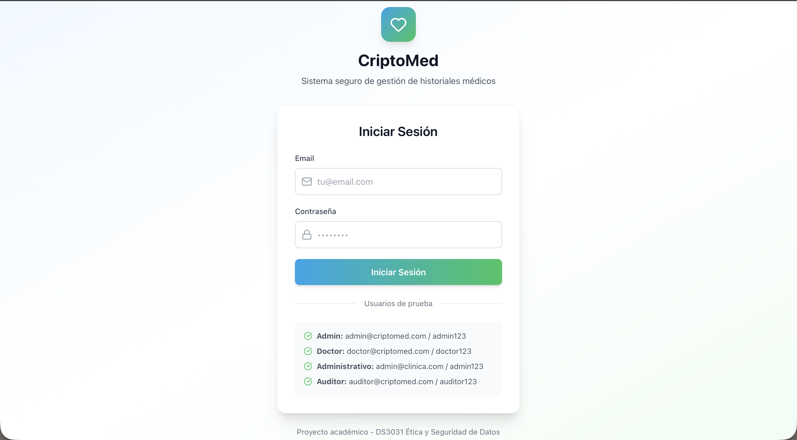
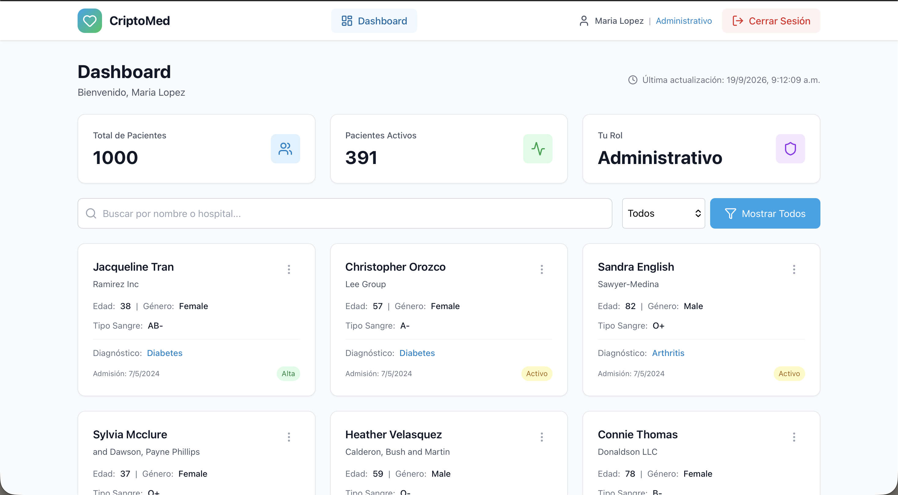
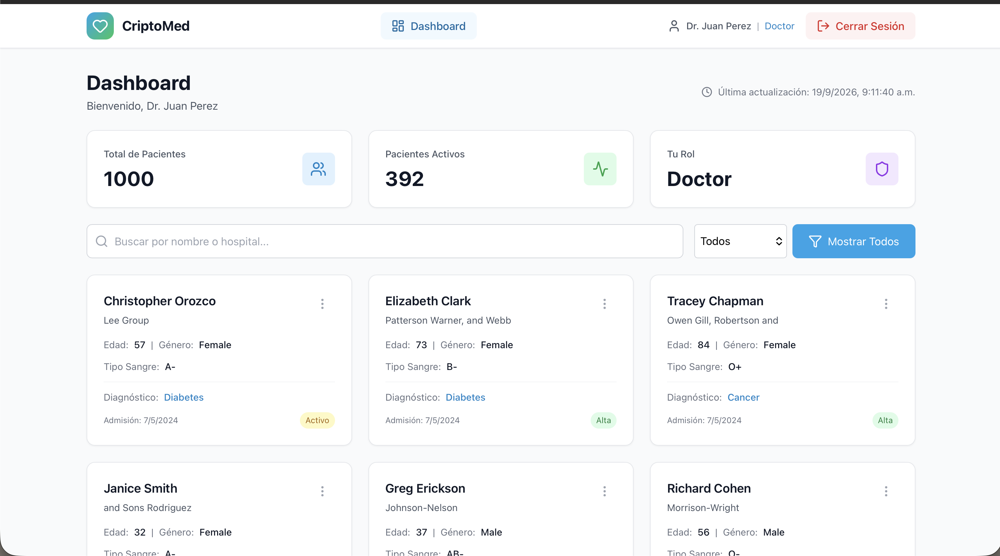
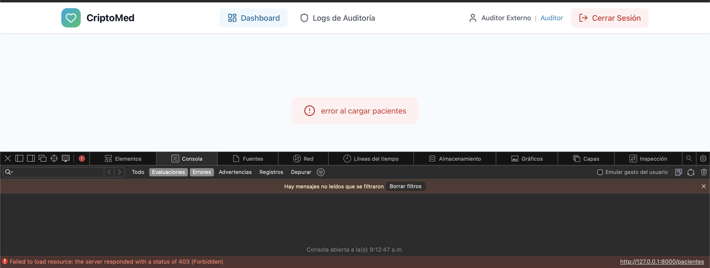

# Procedimientos de Gestión de Usuarios - CriptoMed

## Resumen Ejecutivo
Este documento describe los procedimientos para gestionar usuarios en el sistema CriptoMed, incluyendo creación, modificación, suspensión y eliminación de cuentas.

## 1. Creación de Usuarios

### 1.1 Roles Disponibles
- **admin:** Acceso total al sistema (usuarios, pacientes, logs, configuración)
- **doctor:** Acceso a pacientes asignados, diagnóstico completo
- **administrativo:** Acceso a datos básicos y facturación (sin diagnóstico detallado)
- **auditor:** Acceso solo a logs de auditoría

### 1.2 Procedimiento de Creación

**Paso 1: Verificar permisos**
- Solo usuarios con rol `admin` pueden crear nuevos usuarios
- El solicitante debe justificar la necesidad del nuevo usuario

**Paso 2: Recopilar información del usuario**
- Nombre completo
- Email institucional (requisito: @utec.edu.pe o dominio autorizado)
- Rol solicitado (con justificación)
- Fecha de inicio y fin (si es temporal)

**Paso 3: Crear usuario en el sistema**
```bash
# Opción 1: Via API (recomendado)
POST /usuarios
{
  "nombre": "Juan Perez",
  "email": "juan.perez@utec.edu.pe",
  "password": "ContraseñaTemporal123!",
  "rol": "doctor",
  "activo": true
}

# Opción 2: Via script
python backend/scripts/create_user.py
```

**Paso 4: Comunicar credenciales iniciales**
- Enviar contraseña temporal al usuario por email seguro
- Instruir al usuario que debe cambiar la contraseña en el primer login
- Proporcionar enlace para restablecer contraseña si olvidó

**Paso 5: Verificación**
- Verificar que el usuario pueda hacer login
- Verificar que el usuario tenga acceso a los recursos según su rol
- Registrar en logs de auditoría la creación del usuario

### 1.3 Cuentas Temporales
- Para personal temporal (practicantes, contratistas):
  - Establecer fecha de inicio y fin
  - Crear cuenta con fecha de expiración
  - Notificar al usuario 7 días antes de la expiración
  - Al expirar, la cuenta se desactiva automáticamente

## 2. Modificación de Usuarios

### 2.1 Cambio de Rol
- Solo `admin` puede cambiar roles
- Debe haber justificación documentada
- Cambio de rol debe ser aprobado por supervisor
- Se registra en logs de auditoría

**Procedimiento:**
```bash
PATCH /usuarios/{id}/rol
{
  "rol": "doctor"
}
```

### 2.2 Cambio de Estado (Activación/Desactivación)
- `admin` puede activar/desactivar usuarios
- Razones para desactivación:
  - Salida del personal
  - Suspensión disciplinaria
  - Compromiso de credenciales
  - Fin de contrato temporal

**Procedimiento:**
```bash
PATCH /usuarios/{id}/revocar
```

### 2.3 Actualización de Información Personal
- Los usuarios pueden actualizar su propio nombre
- El email no puede cambiarse (requiere aprobación de admin)
- La actualización se registra en logs de auditoría

## 3. Suspensión de Cuentas

### 3.1 Razones para Suspensión
- Compromiso de credenciales (5 intentos fallidos de login)
- Actividad sospechosa (acceso anormal a datos)
- Violación de políticas de seguridad
- Request de supervisor (por disciplina o investigación)

### 3.2 Procedimiento de Suspensión
**Paso 1: Investigación**
- Revisar logs de auditoría del usuario
- Identificar actividades sospechosas
- Recopilar evidencia si aplica

**Paso 2: Suspensión**
```bash
PATCH /usuarios/{id}/revocar
```

**Paso 3: Notificación**
- Notificar al usuario sobre la suspensión
- Explicar razón y duración
- Proporcionar proceso de apelación

**Paso 4: Monitoreo**
- Monitorear intentos de acceso durante suspensión
- Si hay intentos de acceso no autorizados, considerar escalación

### 3.3 Reactivación
- Solo `admin` puede reactivar cuentas
- Requiere aprobación de supervisor o resolución del incidente
- El usuario debe cambiar contraseña antes de reactivar

## 4. Eliminación de Cuentas

### 4.1 Casos de Eliminación
- Salida definitiva del personal
- Cuentas duplicadas
- Cuentas de prueba después de desarrollo

### 4.2 Procedimiento de Eliminación
**Paso 1: Verificar que no haya datos activos**
- Revisar si el usuario tiene pacientes asignados
- Revisar si el usuario tiene logs recientes
- Si hay datos activos, reasignar a otro usuario antes de eliminar

**Paso 2: Eliminar cuenta**
```bash
DELETE /usuarios/{id}
```

**Paso 3: Conservar logs**
- Los logs del usuario se conservan para auditoría
- No se eliminan logs por 1 año después de eliminación
- Los datos personales se anonimizan después de 6 meses

### 4.3 Soft Delete

---

## Evidencia de Implementación

**Sistema de Login con Múltiples Roles:**

- Pantalla de login con email/contraseña
- Usuarios de prueba para cada rol

**Dashboard del Admin:**

- El admin tiene acceso completo a todos los pacientes
- Puede ver diagnósticos completos y facturación

**Dashboard del Administrativo:**

- El administrativo puede ver pacientes (datos básicos)
- Restricciones según principio de mínimo privilegio

**Dashboard del Doctor:**

- El doctor puede ver pacientes asignados
- Acceso a diagnóstico completo

**Auditor sin acceso a Dashboard:**

- El auditor no puede acceder al dashboard (RBAC funcionando)
- Solo puede acceder a logs de auditoría

**Logs de Auditoría del Auditor:**

- El auditor tiene acceso de solo lectura a logs
- No puede modificar ni eliminar logs
- En lugar de eliminar, marcar como `activo: false`
- Los datos se conservan en la base de datos
- El usuario no puede hacer login pero sus datos persisten
- Útil para investigaciones post-incidente

## 5. Offboarding (Salida de Personal)

### 5.1 Proceso de Offboarding
**30 días antes de la salida:**
- Notificar al usuario sobre su salida
- Solicitar transferencia de pacientes asignados
- Solicitar devolución de equipos institucionales

**Último día:**
- Desactivar cuenta
- Revocar todos los tokens JWT activos
- Recopilar credenciales de acceso
- Entregar letter de buenas prácticas de seguridad

**30 días después:**
- Eliminar cuenta de la base de datos
- Anonimizar datos personales en logs
- Eliminar credenciales de acceso

### 5.2 Checklist de Offboarding
- [ ] Usuario notificado con 30 días de anticipación
- [ ] Pacientes reasignados a otro doctor
- [ ] Equipos devueltos
- [ ] Cuenta desactivada
- [ ] Tokens JWT revocados
- [ ] Credenciales eliminadas
- [ ] Datos anonimizados en logs
- [ ] Cuenta eliminada

## 6. Gestión de Contraseñas

### 6.1 Reset de Contraseña
- Los usuarios pueden solicitar reset a través del admin
- El admin genera contraseña temporal
- El usuario debe cambiarla en el primer login
- La contraseña temporal expira en 24 horas

### 6.2 Política de Contraseñas
- Ver documento `PASSWORD_POLICY.md` para detalles completos
- Resumen: 12 caracteres mínimo, rotación cada 90 días

## 7. Auditoría y Cumplimiento

### 7.1 Logs de Auditoría
- Todas las acciones de gestión de usuarios se registran:
  - Creación de usuario
  - Cambio de rol
  - Desactivación/activación
  - Eliminación de cuenta
  - Reset de contraseña

### 7.2 Reportes Mensuales
- Generar reporte de usuarios activos
- Identificar cuentas inactivas que pueden eliminarse
- Identificar cuentas sin actividad que requieren revisión
- Reportar a dirección sobre cambios en personal

### 7.3 Revisión Trimestral
- Revisar necesidad de cada usuario
- Eliminar cuentas que ya no son necesarias
- Actualizar roles según cambios organizacionales
- Capacitación sobre políticas de seguridad

## 8. Contactos y Soporte

### 8.1 Soporte Técnico
- Para problemas de acceso: [email]
- Para problemas técnicos: [email]

### 8.2 Escalación
- Para aprobar cambios de rol: [email]
- Para apelar suspensiones: [email]
- Para incidentes de seguridad: [email]

---

## Resumen Ejecutivo

**Objetivo:** Gestionar el ciclo de vida de usuarios en CriptoMed de forma segura y auditada

**Principios:**
- Solo admin puede crear/modificar usuarios
- Roles definidos con principio de mínimo privilegio
- Toda acción se registra en logs de auditoría
- Offboarding estructurado con conservación de datos
